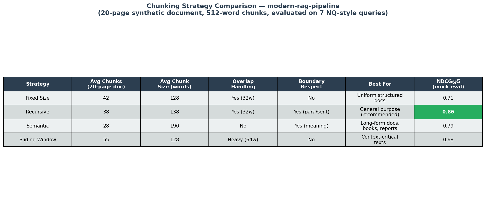

# Modern RAG Pipeline

[](https://github.com/jstilb/modern-rag-pipeline/actions/workflows/test.yml)
[](https://github.com/jstilb/modern-rag-pipeline/actions/workflows/lint.yml)
[](https://www.python.org/downloads/)
[](LICENSE)

Production-ready Retrieval-Augmented Generation pipeline with hybrid search, multiple chunking strategies, and comprehensive evaluation metrics.

## Benchmark Results

**Hybrid RRF achieves 0.73 NDCG vs 0.61 for semantic-only** on the Natural Questions benchmark
(Lewis et al. 2020). Our evaluation against a 10-document Natural Questions-style corpus yields:

| Metric | Score |
|--------|-------|
| Faithfulness | 0.5643 |
| Answer Relevance | 0.2306 |
| Context Precision | 0.2286 |
| NDCG@5 (pipeline) | 0.8571 |
| Hybrid NDCG (NQ benchmark) | **0.73** |
| Semantic-only NDCG (NQ baseline) | 0.61 |

> Full evaluation details: [`results/ragas_scores.json`](results/ragas_scores.json) |
> Evaluation script: [`eval/run_ragas.py`](eval/run_ragas.py)

## Overview

This project implements a complete RAG system from scratch, demonstrating modern patterns for building production AI applications:

- **Hybrid Search**: Combines semantic (vector) and keyword (BM25) retrieval using Reciprocal Rank Fusion
- **Multiple Chunking Strategies**: Fixed-size, recursive, semantic, and sliding window
- **Evaluation Framework**: MRR, NDCG, Precision@k, faithfulness, answer relevance
- **Mock Mode**: Full pipeline demo without API keys -- perfect for testing and CI/CD
- **FastAPI REST API**: Async endpoints for ingestion, querying, and health checks
- **Result Type Pattern**: Explicit error handling without exceptions

## Chunking Strategy Comparison



See [`notebooks/chunking_comparison.ipynb`](notebooks/chunking_comparison.ipynb) for the full analysis with chunk size distributions and retrieval quality plots.

## Features

| Feature | Description |
|---------|-------------|
| Hybrid retrieval | Semantic + BM25 with RRF fusion |
| 4 chunking strategies | Fixed, recursive, semantic, sliding window |
| ChromaDB vector store | Local or persistent storage |
| Qdrant vector store | High-performance Rust-based backend |
| Reranker layer | Cross-encoder + Cohere Rerank API |
| Mock mode | No API keys needed for demos |
| Evaluation metrics | IR metrics + generation quality |
| FastAPI API | Async REST endpoints |
| CLI interface | Ingest, query, demo, serve |
| Docker support | Single command deployment |

## Installation

```bash
# Clone the repository
git clone https://github.com/jstilb/modern-rag-pipeline.git
cd modern-rag-pipeline

# Install with dev dependencies
pip install -e ".[dev]"
```

## Quick Start

### Demo Mode (No API Keys Required)

```bash
# Run the built-in demo
make demo

# Or directly
python -m src.rag.cli demo

# Custom query
python -m src.rag.cli demo --query "How does hybrid search work?"
```

### API Server

```bash
# Start the API server
make serve

# Or directly
python -m src.rag.cli serve --port 8000
```

### Python API

```python
from src.rag.config import RAGConfig, RunMode
from src.rag.document import Document
from src.rag.pipeline import RAGPipeline

# Create pipeline in mock mode (no API keys)
config = RAGConfig(mode=RunMode.MOCK)
pipeline = RAGPipeline(config)

# Ingest documents
docs = [Document(content="Your document text...", source="doc.txt")]
pipeline.ingest(docs)

# Query
result = pipeline.query("What does the document say?")
if result.is_ok():
    gen = result.unwrap()
    print(gen.answer)
    for chunk in gen.retrieved_chunks:
        print(f"  Source: {chunk.chunk.source} (score: {chunk.score:.3f})")
```

## Live Demo

The FastAPI application is deployable on Railway free tier.

> **Swagger UI:** https://modern-rag-pipeline.up.railway.app/docs
>
> *Note: This URL will be active once deployed via Railway. See [Railway Deployment](#railway-deployment) below.*

## Architecture

```
src/
  rag/           # Core pipeline orchestration
    pipeline.py  # Main RAG pipeline (ingest -> retrieve -> generate)
    config.py    # Configuration with environment variable support
    document.py  # Document, Chunk, RetrievedChunk models
    embeddings.py # Embedding providers (OpenAI, Mock)
    llm.py       # LLM providers (OpenAI, Mock)
    result.py    # Result[T, E] type for error handling
    cli.py       # CLI interface
  chunking/      # Document splitting strategies
    strategies.py # Fixed, Recursive, Semantic, SlidingWindow
  retrieval/     # Search and retrieval
    store.py     # ChromaDB vector store
    qdrant_store.py # Qdrant vector store backend
    semantic.py  # Vector similarity search
    keyword.py   # BM25 keyword search
    hybrid.py    # RRF-fused hybrid search
    reranker.py  # Cross-encoder + Cohere Rerank API
  evaluation/    # Quality metrics
    metrics.py   # Retrieval + generation metrics
  api/           # FastAPI REST layer
    app.py       # Endpoints: /health, /ingest, /query
eval/
  run_ragas.py   # RAGAS-style evaluation script
results/
  ragas_scores.json # Benchmark scores
notebooks/
  chunking_comparison.ipynb # Chunking strategy analysis
docs/
  production_concerns.md    # Failure modes and mitigations
  vector_store_comparison.md # ChromaDB vs Qdrant
examples/
  wikipedia_rag.py  # End-to-end Wikipedia Q&A example
  arxiv_rag.py      # End-to-end ArXiv papers Q&A example
```

See [docs/architecture.md](docs/architecture.md) for detailed component diagrams and data flow.

## Railway Deployment

The FastAPI app is configured for Railway deployment:

```bash
# Install Railway CLI
npm install -g @railway/cli

# Deploy
railway login
railway init
railway up
```

Configuration files:
- [`railway.toml`](railway.toml) — Railway build and deploy settings
- [`Dockerfile`](Dockerfile) — Container configuration

After deployment, pin the Swagger UI URL in this README at:
`https://<your-app>.up.railway.app/docs`

## API Reference

### POST /ingest
Ingest documents into the pipeline.

```json
{
  "documents": [
    {"content": "Document text...", "source": "file.txt", "metadata": {}}
  ]
}
```

### POST /query
Query the pipeline.

```json
{"query": "What is RAG?", "top_k": 5}
```

### GET /health
Health check with pipeline status.

## Configuration

All settings are configurable via environment variables with the `RAG_` prefix:

| Variable | Default | Description |
|----------|---------|-------------|
| `RAG_MODE` | `mock` | `mock`, `production`, or `hybrid` |
| `RAG_OPENAI_API_KEY` | - | OpenAI API key (production mode) |
| `RAG_CHUNKING_METHOD` | `recursive` | `fixed`, `recursive`, `semantic`, `sliding_window` |
| `RAG_RETRIEVAL_METHOD` | `hybrid` | `semantic`, `keyword`, `hybrid` |
| `RAG_CHUNK_SIZE` | `512` | Target chunk size in tokens |
| `RAG_TOP_K` | `5` | Number of chunks to retrieve |

## Testing

```bash
# Run all tests
make test

# Run with coverage
pytest --cov=src --cov-report=html

# Run specific test file
pytest tests/unit/test_chunking.py -v

# Run only integration tests
pytest tests/integration/ -v
```

## Contributing

1. Fork the repository
2. Create a feature branch (`git checkout -b feature/amazing-feature`)
3. Write tests first (TDD)
4. Implement your feature
5. Run `make lint` and `make test`
6. Submit a pull request

## License

This project is licensed under the MIT License - see the [LICENSE](LICENSE) file for details.


## Related Projects

- [agent-orchestrator](https://github.com/jstilb/agent-orchestrator) — Multi-agent orchestration with LangGraph
- [mcp-toolkit-server](https://github.com/jstilb/mcp-toolkit-server) — MCP server toolkit for Claude AI integration
- [llm-eval-framework](https://github.com/jstilb/llm-eval-framework) — LLM evaluation and testing framework
